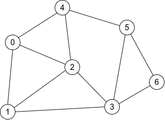
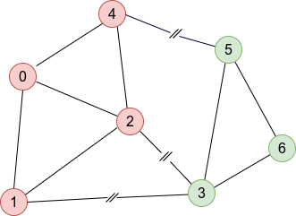

PyMetis: A Python Wrapper for METIS
===================================

.. image:: https://gitlab.tiker.net/inducer/pymetis/badges/main/pipeline.svg
    :alt: Gitlab Build Status
    :target: https://gitlab.tiker.net/inducer/pymetis/commits/main
.. image:: https://github.com/inducer/pymetis/workflows/CI/badge.svg?branch=main
    :alt: Github Build Status
    :target: https://github.com/inducer/pymetis/actions?query=branch%3Amain+workflow%3ACI
.. image:: https://badge.fury.io/py/PyMetis.png
    :alt: Python Package Index Release Page
    :target: https://pypi.org/project/pymetis/
.. image:: https://zenodo.org/badge/2199177.svg
    :alt: Zenodo DOI for latest release
    :target: https://zenodo.org/badge/latestdoi/2199177

PyMetis is a Python wrapper for the `Metis
<http://glaros.dtc.umn.edu/gkhome/views/metis>`_ graph partititioning software
by George Karypis, Vipin Kumar and others. It includes version 5.1.0 of Metis
and wraps it using the `Pybind11 <https://pybind11.readthedocs.io/en/stable/>`_
wrapper generator library. So far, it only wraps the most basic graph
partitioning functionality (which is enough for my current use), but extending
it in case you need more should be quite straightforward. Using PyMetis to
partition your meshes is really easy--essentially all you need to pass into
PyMetis is an adjacency list for the graph and the number of parts you would
like.

Links
-----

* `Documentation <https://documen.tician.de/pymetis>`__ (read how things work)
* `Conda Forge <https://anaconda.org/conda-forge/pymetis>`_ (download binary packages for Linux, macOS, Windows)
* `Python package index <https://pypi.python.org/pypi/pymetis>`_ (download releases)
* `C. Gohlke's Windows binaries <https://www.lfd.uci.edu/~gohlke/pythonlibs/#pymetis>`_ (download Windows binaries)
* `Github <https://github.com/inducer/pymetis>`_ (get latest source code, file bugs)

Installation
------------

The following line should do the job::

    pip install pymetis

Quick Start
-----------

This graph, adapted from Figure 2 of the Metis
`manual <http://glaros.dtc.umn.edu/gkhome/fetch/sw/metis/manual.pdf>`_ to
use zero-based indexing,

can be defined and partitioned into two graphs with

.. code:: python

    import numpy as np
    import pymetis
    adjacency_list = [np.array([4, 2, 1]),
                      np.array([0, 2, 3]),
                      np.array([4, 3, 1, 0]),
                      np.array([1, 2, 5, 6]),
                      np.array([0, 2, 5]),
                      np.array([4, 3, 6]),
                      np.array([5, 3])]
    n_cuts, membership = pymetis.part_graph(2, adjacency=adjacency_list)
    # n_cuts = 3
    # membership = [1, 1, 1, 0, 1, 0, 0]

    nodes_part_0 = np.argwhere(np.array(membership) == 0).ravel() # [3, 5, 6]
    nodes_part_1 = np.argwhere(np.array(membership) == 1).ravel() # [0, 1, 2, 4]

