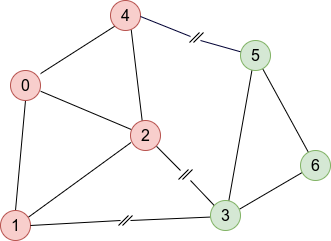

Welcome to pymetis's documentation!
===================================

Quick Start
-----------

This graph, adapted from Figure 2 of the Metis
`manual <http://glaros.dtc.umn.edu/gkhome/fetch/sw/metis/manual.pdf>`_ to
use zero-based indexing,

.. image:: _static/tiny_01.png

can be defined and partitioned into two graphs with

.. code:: python

    import numpy as np
    import pymetis
    adjacency_list = [np.array([4, 2, 1]),
                      np.array([0, 2, 3]),
                      np.array([4, 3, 1, 0]),
                      np.array([1, 2, 5, 6]),
                      np.array([0, 2, 5]),
                      np.array([4, 3, 6]),
                      np.array([5, 3])]
    n_cuts, membership = pymetis.part_graph(2, adjacency=adjacency_list)
    # n_cuts = 3
    # membership = [1, 1, 1, 0, 1, 0, 0]

    nodes_part_0 = np.argwhere(np.array(membership) == 0).ravel() # [3, 5, 6]
    nodes_part_1 = np.argwhere(np.array(membership) == 1).ravel() # [0, 1, 2, 4]

Contents
--------

.. toctree::
    :maxdepth: 2

    functionality
    misc
    🚀 Github <https://github.com/inducer/pymetis>
    💾 Download Releases <https://pypi.org/project/pymetis>

Indices and tables
==================

* :ref:`genindex`
* :ref:`modindex`
* :ref:`search`
